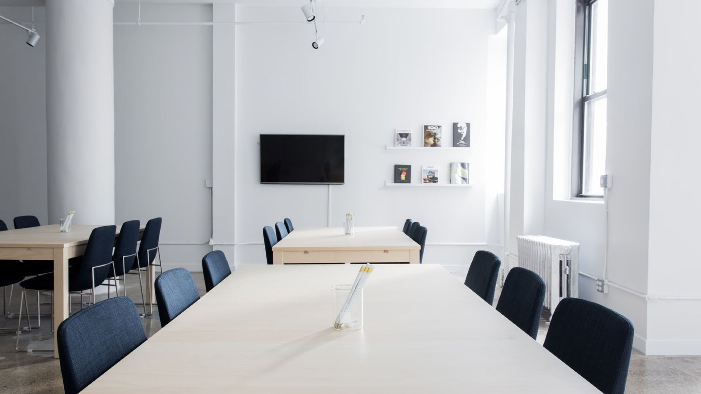

# Boardroom - Decentralized Video Chat With Multiconferencing

# https://www.boardroom.ng

Decentralized video chat platform powered by WebRTC using Twilio STUN/TURN infrastructure.

## Features

- Screen sharing
- Picture in picture
- Live captions
- Text chat
- Auto-scaling video quality
- No download required, entirely browser based
- Direct peer to peer connection ensures lowest latency
- Single use disposable chat rooms

## This Project is not open source 

- You will need to have Node.js installed, this project has been tested with Node version 10.X and 12.X
- Fully Owned By Minsystems NG
